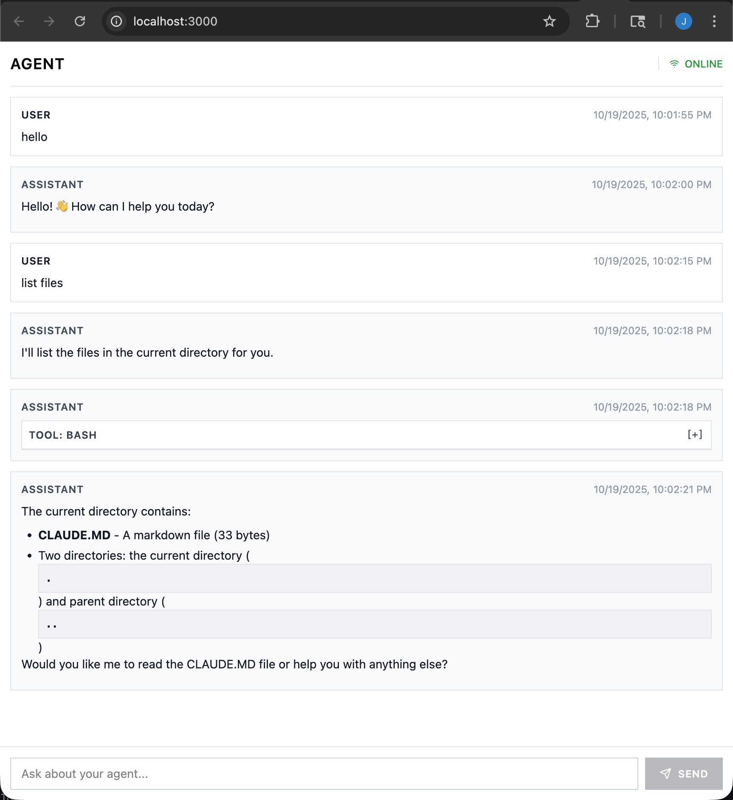

# Claude Agent SDK 基础示例

本项目是一个基于 `@anthropic-ai/claude-agent-sdk` 构建的最小化端到端聊天体验。它结合了轻量级的 Bun 服务器、React 客户端和流式 WebSocket 桥接，展示了如何将 SDK 集成到基于浏览器的对话界面中。

该示例附带了一个启动系统提示词（见 `ccsdk/agent-prompt.ts`）和一个专用的 agent 工作空间，根目录位于 `./agent`，模拟了生产环境中 Claude Agent 项目如何组织其提示词和文件。



## 功能特性
- 使用 `@anthropic-ai/claude-agent-sdk` 通过 WebSocket 进行流式聊天。
- 基于 Bun 的服务器，提供客户端打包并将消息转发到 SDK。
- React + Tailwind 聊天界面，具备会话感知能力。
- Agent 工作空间沙箱化到 `./agent`，方便在项目中迭代笔记本、文档和辅助脚本。

## 项目结构
- `ccsdk/` – Claude Agent SDK 的轻量封装（提示词、AI 客户端、会话编排、WebSocket 处理器）。
- `client/` – 在浏览器中渲染的 React UI；连接到 WebSocket 端点并显示聊天记录。
- `server/` – Bun 服务器，包含 HTTP 路由、WebSocket 升级处理器以及基本的 CSS/TS 转译。
- `agent/` – 暴露给 Claude agent 的工作目录（在此添加您的笔记、脚本和其他文件）。

## 前置要求
- [Bun](https://bun.sh/) 1.1 或更高版本。
- 将 Anthropic API 密钥导出为 `ANTHROPIC_API_KEY`（或放置在 Bun 可以加载的 `.env` 文件中）。

## 快速开始
1. 安装依赖：
   ```bash
   bun install
   ```
2. 提供您的 Anthropic 密钥：
   ```bash
   export ANTHROPIC_API_KEY=your-key-here
   ```
3. 启动开发服务器（同时提供 Bun 后端和 React 前端）：
   ```bash
   bun run dev
   ```
4. 访问 `http://localhost:3000` 并开始聊天。消息通过 `/ws` WebSocket 端点从 SDK 流式传输到浏览器。

## 自定义 Agent
- **系统提示词**：编辑 `ccsdk/agent-prompt.ts` 来引导每个会话中模型的行为。
- **工作空间**：将笔记本、脚本和其他 agent 可见的文件放在 `./agent` 目录下。SDK 配置为从该目录运行工具，与 Claude Agent 项目预期的布局相匹配。
- **客户端用户体验**：调整 `client/` 下的 React 组件以修改样式、消息渲染或会话控制。
- **服务器行为**：扩展 `server/server.ts` 或 `ccsdk/` 下的辅助工具以添加 REST 端点、持久化会话或集成其他工具。

有了这些组件，您可以快速迭代 Claude Agent 工作流程，同时保持代码和 agent 工作空间的紧密联系。

